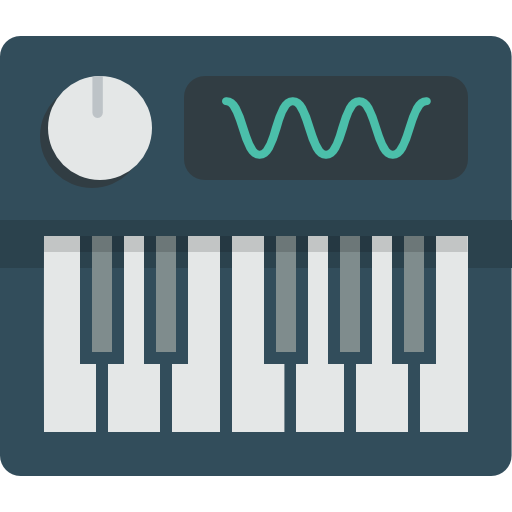

<!-- PROJECT SHIELDS -->
[![Build Status][build-shield]]()
[![Contributors][contributors-shield]]()
[![MIT License][license-shield]][license-url]

<!-- PROJECT LOGO -->
<br />
<p align="center">
  <a href="https://github.com/adadesions/PyKLogger">
    
  </a>

  <h3 align="center">PyKLogger</h3>

  <p align="center">
    A simple key logger program written in Python with GUI powered by Kivy.
    <br />
    <a href="https://github.com/adadesions/PyKLogger"><strong>Explore the docs »</strong></a>
    <br />
    <br />
    ·
    <a href="https://github.com/adadesions/PyKLogger/issues">Report Bug</a>
    ·
    <a href="https://github.com/adadesions/PyKLogger/issues">Request Feature</a>
  </p>
</p>


<!-- ABOUT THE PROJECT -->
## Screenshots 
<p align="center">
  <h3> Startup Screen </h3>
  
  <h3> Recroding Screen </h3>
  
  <h3> Stopping Screen </h3>
  
</p>

### Built With
PyKLogger written in Python and using Kivy as GUI framework 
* [Python](https://python.org)
* [Kivy](https://kivy.org)
* [Pynput](https://pynput.readthedocs.io/en/latest)


<!-- GETTING STARTED -->
## Getting Started

PyKLogger is provide both CLI and GUI for user.

### Prerequisites
CLI 
* Python 3.5+
* Pip 19.1.1+
* Kivy 1.10.1+
* pygame 1.9.6+
* pynput 1.4.2


### Installation and Usage

1. Clone the repo
```sh
git clone https://github.com/adadesions/PyKLogger.git
```
2. Install dependency
```sh
cd PyKLogger
pip install -r requirements.txt
```

3. Running
```python
# GUI
python3 GUI_main.py

# CLI
python3 main.py
```


<!-- CONTRIBUTING -->
## Contributing

Contributions are what make the open source community such an amazing place to be learn, inspire, and create. Any contributions you make are **greatly appreciated**.

1. Fork the Project
2. Create your Feature Branch (`git checkout -b feature-AmazingFeature`)
3. Commit your Changes (`git commit -m 'Add some AmazingFeature`)
4. Push to the Branch (`git push origin feature-AmazingFeature`)
5. Open a Pull Request


<!-- LICENSE -->
## License

Distributed under the MIT License. See `LICENSE` for more information.


<!-- MARKDOWN LINKS & IMAGES -->
[build-shield]: https://img.shields.io/badge/build-passing-brightgreen.svg?style=flat-square
[contributors-shield]: https://img.shields.io/badge/contributors-1-orange.svg?style=flat-square
[license-shield]: https://img.shields.io/badge/license-MIT-blue.svg?style=flat-square
[license-url]: https://choosealicense.com/licenses/mit
[linkedin-shield]: https://img.shields.io/badge/-LinkedIn-black.svg?style=flat-square&logo=linkedin&colorB=555
[start-screenshot]: https://raw.githubusercontent.com/adadesions/PyKLogger/master/screenshots/startup_screen.png
